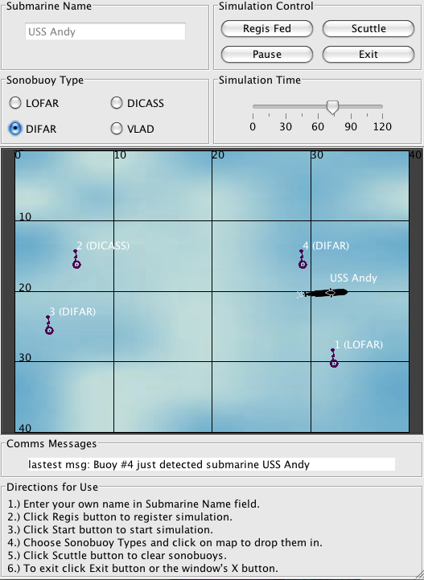

A. Ganse, APL-UW, 1999-2009

MiniSim is a Java2 program thrown together as a test demonstration of a
networked Dept of Defense simulation client.  The simulation networking
component itself was part of a software framework that can't be shared with
the public, but a key concept was that the client is separable from the
simulator so that this part can be shared publicly.  I suppose that really
turns this program into more of a demonstration of Java2 GUI implementation,
but maybe that's useful to someone too.  (Like myself in six months after
I've forgotten all about how I coded this thing.)  A screenshot of the
application is in the file screenshot.png.

The other thing that MiniSim may be useful in demonstrating is for creating a
single piece of Java2 code that can run as both an independent on-screen
application and as an applet situated on a webpage.  So you can run MiniSim
either by entering at the command-line:

`> java -jar MiniSimDemo.jar`

or by bringing up the webpage MiniSim.html in a window of a web browser that
supports Java2 (that webpage in turn calls up MiniSimDemo.jar).  Any modern
browser should support that, but just in case, you can always get a Java
plug-in at http://www.java.com.
Either way the Java applet/application should run right from the provided jar
file.  But you can recreate it via the makefile (I know, I know, but let's not
start another "make" vs "ant" argument here) as follows:

`> make`

This  compiles the *.java code into *.class files and puts the class files into
MiniSimDemo.jar, and also creates the JavaDoc directory documenting the Java
structure of the code.  To view the JavaDoc output point your web browser to
the file doc/javadoc/index.html.  You can also recreate the MiniSim.src.jar
file via:

`> make srcjar`

And to remove all the extraneous files created during the above:

`> make clean`

MiniSim essentially consists of two halves: the graphical user interface (GUI)
that we see on the screen, and the simulator interface that keeps track of the
numerical values for the various objects being simulated and communicates these
values back and forth with other simulators.  A UML class diagram for the
program is provided in the file classDiagram.gif (and I must credit ArgoUML for
its handy open source UML diagramming ability).  The classes related to the
GUIFrame are on the left, and the classes associated with the simulation
interface SimInterface are on the right. They're both instantiated from the
main MiniSim class. The GUIFrame is updated and redrawn every quarter of a
second or so (or however often one likes) by the AnimTimer. Before redrawing
its time slider and little submarines on its map display, GUIFrame asks the
latest values for those things from the SimInterface, which runs as a separate
thread and updates itself at some different rate by the SimTimer (generally
faster than the GUI updates). The GUIFrame also accepts some input, like
mouse-clicks for new sonobuoy drops, which it passes on to the SimInterface.

The SimInterface is the key to a networked simulation implementation.  MiniSim
gets from its SimInterface the time and an up-to-date list of the positions,
speeds, and so on from each NavalObject (like submarines and sonobuoys)
participating in the simulation.  The NavalObjects might be local in the same
Java program instance on the same computer, or they might be running on some
remote computer.  The Submarine and Sonobuoy objects specified locally within
this example code are very rudimentary in terms of their motion and sensing
abilities, but the SimInterface could alternately take the Submarine and
Sonobuoy information from more complicated "real" simulators running outside of
MiniSim, providing their information either via simple network sockets or a
more involved simulation framework, to the SimInterface.  My original intent with
this public demo version of the code was to create a simple socket framework in
the SimInterface so that two MiniSim instances on the same LAN could automatically
find each other via sockets and send the sub and sonobuoy info to each other in
a "Battleship" game-like demonstration.  Each "player" would not see the
other's sub but each would deposit sonobuoys into the field that ping when
sensing the other's sub.  Alas I never got to that part.  Still, the thing
operates on its own and lets you deposit sonobuoys which report sensing the sub
while it drives around.  So again it's a GUI/simulation demonstration rather
than a fun game to play with (or you'd have to be REALLY bored).

Andy Ganse

----
Latest update 16sep2009:
With more recent releases of Java, note that when I compile the Java code now
with Java1.5 on OSX I see the following warning:
"Note: ./SimInterface.java uses unchecked or unsafe operations.
 Note: Recompile with -Xlint:unchecked for details."
The applet/application still appears to run fine as both applet and
application, but before relying on it for anything else you may want to
go figure out the "unchecked" or "unsafe" part of the code to stay current.
A super quick initial Googling seems to imply this might relate to one of the
Enumeration calls and might be new with Java1.5, but that was a very quick
look and I'm honestly not sure...

